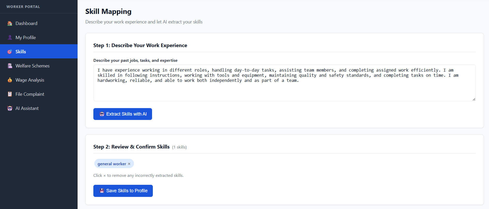
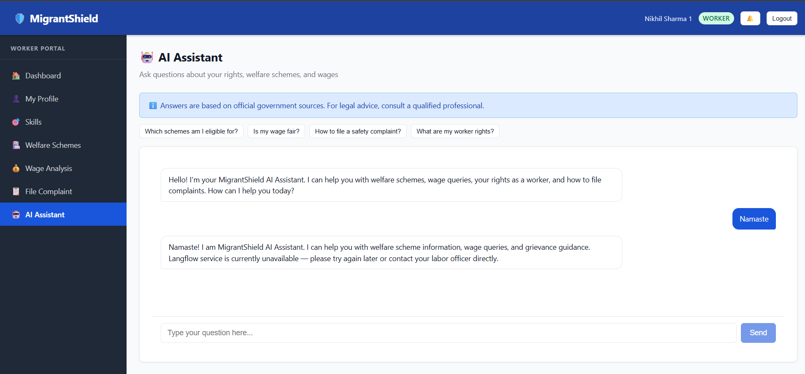

# MigrantShield 🛡️

> **Migrant Worker Welfare Platform for India** — A full-stack MERN + AI platform powered by IBM Watsonx.ai and Langflow to protect the rights, welfare, and livelihoods of India's 140+ million migrant workers.

---

## Table of Contents

1. [Project Overview](#project-overview)
2. [Tech Stack](#tech-stack)
3. [Prerequisites](#prerequisites)
4. [Directory Structure](#directory-structure)
5. [Setup Instructions](#setup-instructions)
6. [API Endpoint Reference](#api-endpoint-reference)
7. [IBM Cloud / Watsonx.ai Setup](#ibm-cloud--watsonxai-setup)
8. [Langflow Setup](#langflow-setup)
9. [User Roles](#user-roles)
10. [Docker Deployment](#docker-deployment)

---

## Project Overview

MigrantShield addresses the vulnerability of migrant workers across India by providing:

- **Worker Registration & Digital Identity** — Aadhaar-linked profiles with skill mapping and migration history.
- **Welfare Scheme Discovery** — AI-powered eligibility matching against PMAY, ESIC, BOCW, PM-JAY, and more.
- **Wage Fairness Analysis** — Real-time comparison against government minimum wage references.
- **Grievance Management** — End-to-end complaint tracking from submission to resolution with officer assignment.
- **Employer Compliance Monitoring** — Risk scoring for contractors and employers based on violations.
- **AI Assistant** — IBM Granite LLM via Langflow for multilingual Q&A, skill extraction, and complaint classification.
- **Government Dashboard** — Geospatial analytics, sector breakdowns, and compliance heat maps for labor officers.

---

## Tech Stack

| Layer    | Technology                                          |
| -------- | --------------------------------------------------- |
| Frontend | React 18, React Router v6, Axios, CSS Modules       |
| Backend  | Node.js 20, Express 4, Mongoose 8                   |
| Database | MongoDB 7                                           |
| AI / LLM | IBM Watsonx.ai (Granite 13B), Langflow 1.x          |
| Auth     | JWT (jsonwebtoken), bcryptjs                        |
| DevOps   | Docker, Docker Compose                              |
| Security | Helmet, CORS, express-rate-limit, express-validator |
| Email    | Nodemailer (SMTP)                                   |

---

## Prerequisites

- **Node.js** v18 or v20 ([nodejs.org](https://nodejs.org))
- **npm** v9+
- **MongoDB** 6 or 7 (local or Atlas)
- **Docker** & **Docker Compose** (for containerised deployment)
- IBM Cloud account with a Watsonx.ai project (optional — app runs with stubs without it)
- Langflow installed locally or as a service (optional — stubs are provided)

---

## Directory Structure

```
migrantshield/
├── backend/              Express API server
│   ├── config/           MongoDB connection
│   ├── middleware/        JWT auth + role guards
│   ├── models/           Mongoose schemas (8 models)
│   └── routes/           REST endpoints (9 route files)
├── frontend/             React SPA
│   └── src/
│       ├── api/          Axios instance
│       ├── context/      Auth context
│       ├── components/   Navbar, Sidebar, PrivateRoute
│       └── pages/        Worker / Employer / Government / Admin views
├── langflow/flows/       Langflow AI agent flow definitions
├── scripts/              Database seed script
├── docker-compose.yml    Multi-service Docker setup
└── README.md
```

---

## Setup Instructions

### 1. Clone the repository

```bash
git clone https://github.com/your-org/migrantshield.git
cd migrantshield
```

### 2. Install backend dependencies

```bash
cd backend
npm install
```

### 3. Install frontend dependencies

```bash
cd ../frontend
npm install
```

### 4. Configure environment variables

```bash
cp backend/.env.example backend/.env
```

Edit `backend/.env` and fill in the required values:

```env
PORT=5000
MONGODB_URI=mongodb://localhost:27017/migrantshield
JWT_SECRET=change_this_to_a_long_random_string
JWT_EXPIRES_IN=7d

WATSONX_API_KEY=your_ibm_cloud_api_key
WATSONX_PROJECT_ID=your_watsonx_project_id
WATSONX_URL=https://us-south.ml.cloud.ibm.com
GRANITE_MODEL_ID=ibm/granite-13b-chat-v2

LANGFLOW_URL=http://localhost:7860
LANGFLOW_API_KEY=your_langflow_api_key

SMTP_HOST=smtp.gmail.com
SMTP_PORT=587
SMTP_USER=your_email@gmail.com
SMTP_PASS=your_app_password

CLIENT_URL=http://localhost:3000
```

### 5. Seed the database

```bash
# From the project root
node scripts/seed.js
```

This creates:

- **5 welfare schemes** (PMAY, ESIC, BOCW, PM-JAY, NSP Scholarship)
- **10 wage references** (Gujarat and Bihar, across construction/diamond/textile/agriculture)
- **5 skill records**
- **2 user accounts** (admin + labor officer)

### 6. Start the backend

```bash
cd backend
npm run dev        # Development (nodemon)
# or
npm start          # Production
```

The API will be available at `http://localhost:5000`.

### 7. Start the frontend

```bash
cd frontend
npm start
```

The app will be available at `http://localhost:3000`.

---

## API Endpoint Reference

### Authentication — `/api/auth`

| Method | Endpoint                    | Auth | Description             |
| ------ | --------------------------- | ---- | ----------------------- |
| POST   | `/api/auth/register`        | ❌   | Register a new user     |
| POST   | `/api/auth/login`           | ❌   | Login and receive JWT   |
| POST   | `/api/auth/logout`          | ❌   | Client-side logout stub |
| POST   | `/api/auth/forgot-password` | ❌   | Request password reset  |
| GET    | `/api/auth/me`              | ✅   | Get current user info   |

### Workers — `/api/workers`

| Method | Endpoint                               | Auth | Roles           | Description                       |
| ------ | -------------------------------------- | ---- | --------------- | --------------------------------- |
| POST   | `/api/workers`                         | ✅   | any             | Create worker profile             |
| GET    | `/api/workers`                         | ✅   | admin, officers | List all workers (paginated)      |
| GET    | `/api/workers/:id`                     | ✅   | own or officers | Get worker by ID                  |
| PUT    | `/api/workers/:id`                     | ✅   | own or officers | Update worker profile             |
| GET    | `/api/workers/:id/welfare-eligibility` | ✅   | any             | Welfare scheme eligibility check  |
| GET    | `/api/workers/:id/wage-analysis`       | ✅   | any             | Compare wage vs minimum reference |

### Skills — `/api/skills`

| Method | Endpoint              | Auth | Roles | Description                    |
| ------ | --------------------- | ---- | ----- | ------------------------------ |
| GET    | `/api/skills`         | ❌   | —     | List all skills (with filters) |
| POST   | `/api/skills`         | ✅   | admin | Create a new skill             |
| POST   | `/api/skills/extract` | ✅   | any   | Extract skills from free text  |

### Welfare Schemes — `/api/welfare`

| Method | Endpoint           | Auth | Roles | Description         |
| ------ | ------------------ | ---- | ----- | ------------------- |
| GET    | `/api/welfare`     | ❌   | —     | List active schemes |
| GET    | `/api/welfare/:id` | ❌   | —     | Get scheme detail   |
| POST   | `/api/welfare`     | ✅   | admin | Create scheme       |
| PUT    | `/api/welfare/:id` | ✅   | admin | Update scheme       |

### Wage References — `/api/wages`

| Method | Endpoint             | Auth | Roles | Description            |
| ------ | -------------------- | ---- | ----- | ---------------------- |
| GET    | `/api/wages`         | ❌   | —     | List wage references   |
| POST   | `/api/wages`         | ✅   | admin | Create wage reference  |
| POST   | `/api/wages/analyze` | ✅   | any   | Wage fairness analysis |

### Grievances — `/api/grievances`

| Method | Endpoint                       | Auth | Roles           | Description          |
| ------ | ------------------------------ | ---- | --------------- | -------------------- |
| POST   | `/api/grievances`              | ✅   | any (worker)    | Submit grievance     |
| GET    | `/api/grievances`              | ✅   | admin, officers | List grievances      |
| GET    | `/api/grievances/:id`          | ✅   | own or officers | Get grievance detail |
| PUT    | `/api/grievances/:id/status`   | ✅   | admin, officers | Update status        |
| PUT    | `/api/grievances/:id/assign`   | ✅   | admin           | Assign officer       |
| POST   | `/api/grievances/:id/escalate` | ✅   | own or officers | Escalate complaint   |

### Employers — `/api/employers`

| Method | Endpoint                        | Auth | Roles           | Description          |
| ------ | ------------------------------- | ---- | --------------- | -------------------- |
| POST   | `/api/employers`                | ✅   | any             | Register employer    |
| GET    | `/api/employers`                | ✅   | admin, officers | List employers       |
| GET    | `/api/employers/:id`            | ✅   | own or officers | Get employer profile |
| PUT    | `/api/employers/:id`            | ✅   | own or officers | Update employer      |
| GET    | `/api/employers/:id/risk-score` | ✅   | any             | Compute risk score   |

### Dashboard — `/api/dashboard` _(Officers & Admin only)_

| Method | Endpoint                             | Description                                |
| ------ | ------------------------------------ | ------------------------------------------ |
| GET    | `/api/dashboard/stats`               | Aggregate counts and alerts                |
| GET    | `/api/dashboard/worker-analytics`    | Breakdown by sector, state, gender         |
| GET    | `/api/dashboard/welfare-analytics`   | Applications by status                     |
| GET    | `/api/dashboard/grievance-analytics` | By category, severity, resolution rate     |
| GET    | `/api/dashboard/wage-analytics`      | Average wages vs reference wages by sector |
| GET    | `/api/dashboard/high-risk-employers` | Employers with high/critical risk level    |

### AI — `/api/ai`

| Method | Endpoint                         | Auth | Description                              |
| ------ | -------------------------------- | ---- | ---------------------------------------- |
| POST   | `/api/ai/chat`                   | ✅   | General chatbot (Granite via Langflow)   |
| POST   | `/api/ai/extract-skills`         | ✅   | Extract skills from job description text |
| POST   | `/api/ai/classify-complaint`     | ✅   | Auto-classify grievance category         |
| POST   | `/api/ai/welfare-recommendation` | ✅   | Personalized welfare scheme suggestions  |

---

## IBM Cloud / Watsonx.ai Setup

1. **Create an IBM Cloud account** at [cloud.ibm.com](https://cloud.ibm.com).
2. **Provision Watson Machine Learning** (WML) service in the `us-south` region.
3. **Create a Watsonx.ai project** at [dataplatform.cloud.ibm.com](https://dataplatform.cloud.ibm.com).
4. **Generate an API key** under _Manage → Access (IAM) → API Keys_.
5. Copy your `Project ID` from the project settings page.
6. Set in `backend/.env`:
   ```
   WATSONX_API_KEY=<your_api_key>
   WATSONX_PROJECT_ID=<your_project_id>
   WATSONX_URL=https://us-south.ml.cloud.ibm.com
   GRANITE_MODEL_ID=ibm/granite-13b-chat-v2
   ```

> **Note:** The app runs fully without Watsonx credentials. All AI routes fall back to stub responses if Langflow or IBM services are unavailable.

---

## Langflow Setup

1. **Install Langflow**:
   ```bash
   pip install langflow
   langflow run --port 7860
   ```
2. Open `http://localhost:7860` in your browser.
3. Import the flow JSON files from `langflow/flows/`:
   - `welfare_agent.json` — Welfare eligibility RAG agent
   - `wage_agent.json` — Wage analysis agent
   - `grievance_agent.json` — Complaint classification agent
   - `chatbot_flow.json` — General Q&A chatbot
4. Copy the Flow ID from each flow's URL.
5. Set in `backend/.env`:
   ```
   LANGFLOW_URL=http://localhost:7860
   LANGFLOW_API_KEY=<your_langflow_api_key>
   ```

---

## User Roles

| Role               | Access Level                                                         |
| ------------------ | -------------------------------------------------------------------- |
| `worker`           | Own profile, welfare eligibility, wage analysis, file grievances     |
| `employer`         | Own employer profile, compliance view                                |
| `labor_officer`    | All workers, grievances, wage monitoring; cannot modify admin data   |
| `district_officer` | Same as labor_officer, district-scoped analytics                     |
| `admin`            | Full access — user management, scheme management, officer assignment |

**Seed credentials:**
| Email | Password | Role |
|------------------------------------|---------------|---------------|
| admin@migrantshield.gov.in | Admin@1234 | admin |
| officer@migrantshield.gov.in | Officer@1234 | labor_officer |

---

## Docker Deployment

```bash
# From the migrantshield/ root directory
cp backend/.env.example backend/.env
# Edit backend/.env with your values

docker-compose up --build
```

Services started:

- **MongoDB** on port `27017`
- **Backend API** on port `5000`
- **Frontend** on port `3000`

MongoDB data is persisted in the `mongo_data` Docker volume.

---

_Built for the welfare and dignity of India's migrant workers._




